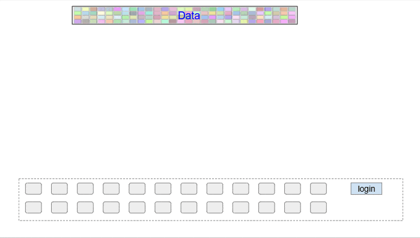
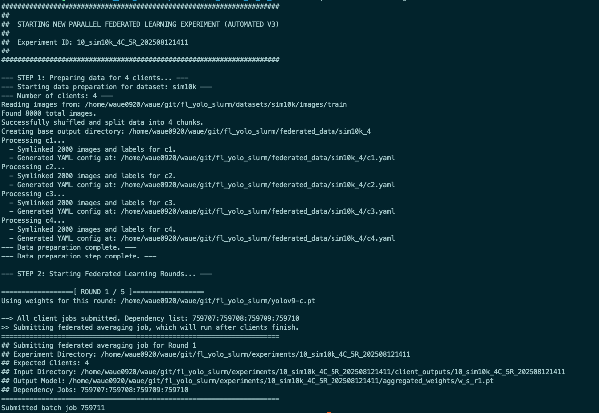

[**中文說明 (Chinese)**](README_zh.md)

# Paper : FedYOGA implementation 
## Quick Guide

### 1. Introduction

- [1.1 Directory Structure](#-directory-structure)
- [1.2 Dataset Preparation](#-dataset-preparation)

### 2. Execution

Two execution modes:
- (2A) Slurm mode: Default uses NCHC TWCC HPC environment, plug-and-play mode, execution environment is Singularity container.
- (2B) Standalone mode: Execution environment recommends using conda environment, same package library as yolov9.

#### (2A) Slurm Mode
- [2A.1 System Overview](#-system-overview)
- [2A.2 Requirements](#-requirements)
- [2A.3 Quick Start](#-quick-start)
- [2A.4 Replay Experiment](#-replay-experiment)

#### (2B) Standalone Mode
- [2B.1 Environment Setup](#-environment-setup)
- [2B.2 Standalone Mode (No Slurm)](#-standalone-mode-no-slurm)
- [2B.3 Unit Tests](#-unit-tests)

### 3. Validation & Extras
- [3.1 Model Validation](#-model-validation)
- [3.2 Monitoring & Debugging](#-monitoring--debugging)
- [3.3 Supported Algorithms](#-supported-algorithms)

### 4. Execution Result Snapshots

---

## 1. Introduction

### 1.1 Directory Structure
```
.
├── README.md               # Documentation (English)
├── README_zh.md            # Documentation (Chinese)
├── readme_sop.md           # Manual SOP Guide
├── readme_val.md           # Validation Guide
├── readme_debug.md         # Debugging Guide
├── yolov9/                 # YOLOv9 Source (Git Submodule)
├── src/                    # Source Code
│   ├── orchestrate.sh      # Main Script
│   └── ...                 # Helper Scripts
├── data/                   # Dataset YAML Configs
├── datasets/               # Raw Datasets
├── federated_data/         # Partioned Client Data
├── experiments/            # Experiment Outputs
│   └── {EXP_ID}/
├── yolo9t2_ngc2306_20241226.sif    # Singularity Container
└── yolov9-c.pt             # Initial Pre-trained Weights
```

Ensure the following files are in the project root:
- **Singularity Image**: `yolo9t2_ngc2306_20241226.sif` ([twcc-cos download](https://cos.twcc.ai/wauehpcproject/yolo9t2_ngc2306_20241226.sif))
- **Initial Weights**: `yolov9-c.pt` ([official download](https://github.com/WongKinYiu/yolov9/releases/download/v0.1/yolov9-c.pt))


### 1.2 Dataset Preparation
Place your datasets in the `datasets/` directory and create corresponding `.yaml` config files in `data/`.
- **[Dataset Preparation Guide](./readme_datasets.md)**


## 2. Quick Start

### 2A  Fully Automated Mode (Slurm Cluster)

#### 2A.1 System Overview

This framework is designed to implement a complete Federated Learning (FL) workflow using the NCHC HPC cluster environment (TWCC / N5).

The project uses initial model weights (`yolov9-c.pt`) for pre-training. It distributes these weights to multiple Clients. Each Client trains on its own data subset and sends the updated weights back to the Server for aggregation (Federated Averaging) to produce a new global model for the next round. This process repeats for multiple rounds to train a high-performance global model while preserving data privacy.

* Federated Learning Workflow:
```
Round 1: yolov9-c.pt → [Client1, Client2, Client3, Client4] → w_s_r1.pt
Round 2: w_s_r1.pt  → [Client1, Client2, Client3, Client4] → w_s_r2.pt
Round 3: w_s_r2.pt  → [Client1, Client2, Client3, Client4] → w_s_r3.pt
...
```



#### 2A.2 Requirements
- **Execution Environment**: NCHC [TWCC](https://www.nchc.org.tw/Page?itemid=6&mid=10)
  - **OS**: Linux
  - **Scheduler**: Slurm Workload Manager
  - **Container Engine**: Singularity
  - **Python**: ≥ 3.8
  - **GPU**: NVIDIA GPU (CUDA supported)
  - **PyTorch**: PyTorch (≥ 2.1.0)
  - **Experiment Tracking**: Wandb

#### 2A.3 Execution

! Modify WROOT environment variable in src/env.sh

export WROOT="/home/waue0920/fl_yolo_slurm"
export SLURM_ACCOUNT="GOV113119" 


```bash
# Method 1: Using sbatch (All jobs run on worker nodes)
sbatch src/run.sb 

# Method 2: Using orchestrate.sh (Orchestrator runs on login node)
./src/orchestrate.sh kitti 4 2
```
> **Tip**: To include final model validation, add the `--val` flag.

The execution will automatically detect if dataset partitioning is needed, then launch n+1 Slurm processes:
- n client training jobs (parallel)
- 1 server aggregation job (waiting for clients to complete)




#### 2A.4 Replay Experiment

If a Federated Learning experiment fails mid-way, you can use `replay.sh` to resume from the breaking point:

```bash
./src/replay.sh experiments/18_kitti_fedavg_4C_6R_202510010849
```

- ✅ Automatically detects finished rounds
- ✅ Resumes from failure point
- ✅ Complete logging
- ✅ Avoids re-running completed rounds


### 2B Standalone Mode (No Slurm)

Suitable for local environments or servers without Slurm.

- ✅ No Slurm required
- ✅ Sequential execution of client training
- ✅ Good for small-scale testing and debugging
- ✅ Supports dry-run preview

#### 2B.1 Environment Setup
```bash
# Install Python dependencies using YOLOv9's requirements
pip install -r yolov9/requirements.txt
```

#### 2B.2 Run Standalone Mode
* Using kitti dataset as example
* Modify WROOT environment variable in conf/kittiO/4/fedavg_env.sh
* Other slurm settings can be ignored (not used)

export WROOT="/home/waue0920/fl_yolo_slurm"

```bash
# Parameters are read from env.sh
./src/standalone_orchestrate.sh --conf conf/kittiO/4/fedavg_env.sh

# Dry-run mode: Show commands without execution
./src/standalone_orchestrate.sh --dry-run
```


#### 2B.3 Unit Tests

Quickly test aggregation algorithms and training flows:
**Test Process**:
1. Use existing Round 1 client outputs for aggregation test
2. Use aggregated weights for Round 2 client training test
3. Verify loss values and NaN/Inf handling

```bash
# Edit src/run_unit_test.sh to set EXP_ID and algorithm
# Then run:
./src/run_unit_test.sh
```


### 3.1 Model Validation

The system provides complete analysis of FL model performance.
- **[Model Validation Guide](./readme_val.md)**


### 3.2 Monitoring & Debugging

Provides Slurm monitoring, log checking, and solutions for common issues.
- **[Monitoring & Debugging Guide](./readme_debug.md)**


### 3.3 Supported Algorithms

Configure `SERVER_ALG` in `src/env.sh`:

| Algorithm | Description | Scenario | Hyperparameters |
|-----------|-------------|----------|-----------------|
| **fedavg** | Federated Averaging | General, IID Data | - |
| **fedavgm** | FedAvgM (Server Momentum) | Faster Convergence | `SERVER_FEDAVGM_LR`, `SERVER_FEDAVGM_MOMENTUM` |
| **fedawa** | FedAWA (Adaptive Weight Aggregation) | Non-IID Data | `SERVER_FEDAWA_SERVER_LR`, `SERVER_FEDAWA_GAMMA` |
| **fedyoga** | **FedYOGA (Adaptive)** | **Non-IID, Imbalanced** | `SERVER_FEDYOGA_SERVER_LR`, `SERVER_FEDYOGA_GAMMA` |
| **fednova** | FedNova | Heterogeneous Steps | `SERVER_FEDNOVA_MU`, `SERVER_FEDNOVA_LR` |


## 4. Execution Result Snapshots

The following are some visualization results from the Federated Learning process, including model validation performance and training metrics.

### 4.1 Validation Result
This shows the object detection results on validation images after 4 clients and 5 rounds of Federated Learning using the Cityscapes dataset.


### 4.2 Training Metrics (By Round)
The chart below shows the trend of various metrics (such as mAP50, mAP50-95) across 5 federated rounds.


### 4.3 Training Metrics (By Epoch)
The chart below plots all client training epochs continuously, showing the model's learning curve throughout the entire training process.


### 4.4 Wandb Dashboard
Wandb provides detailed experiment tracking. Below is a partial screenshot of this experiment on the Wandb dashboard.

