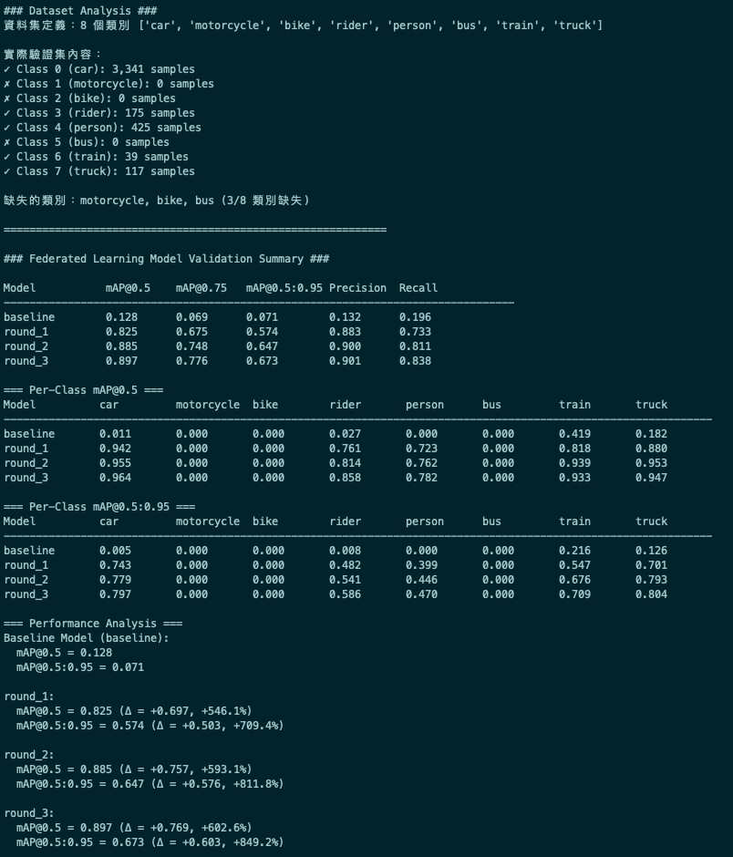
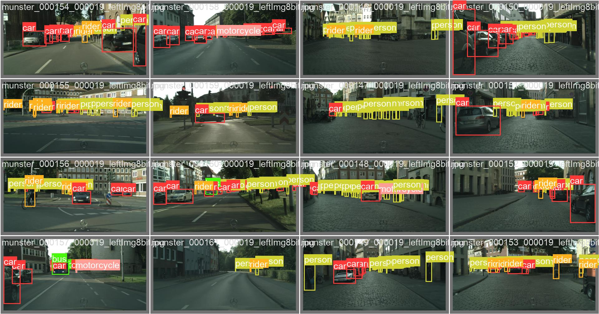
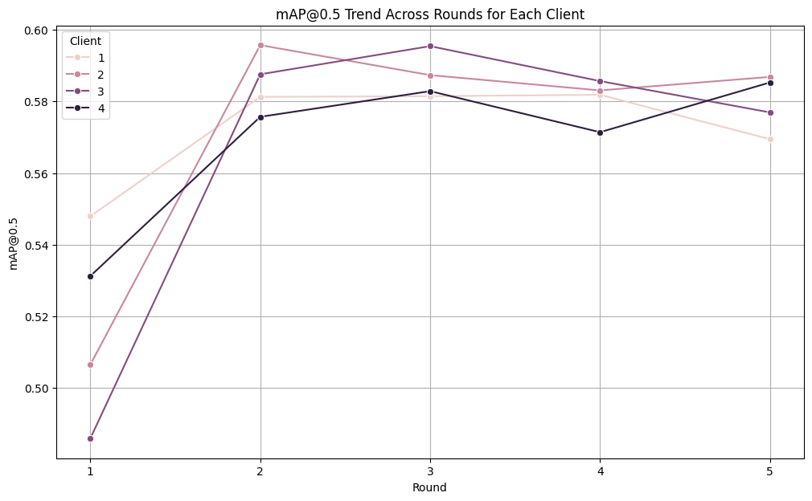
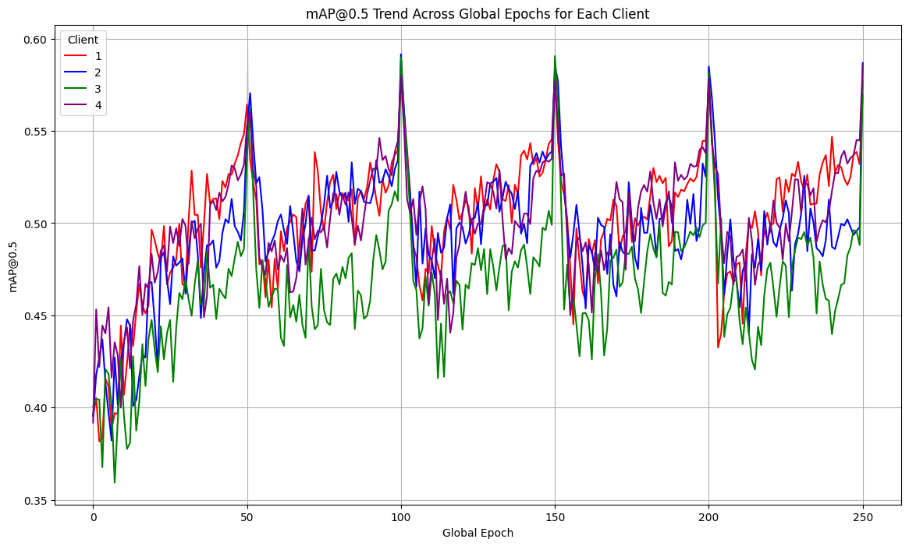
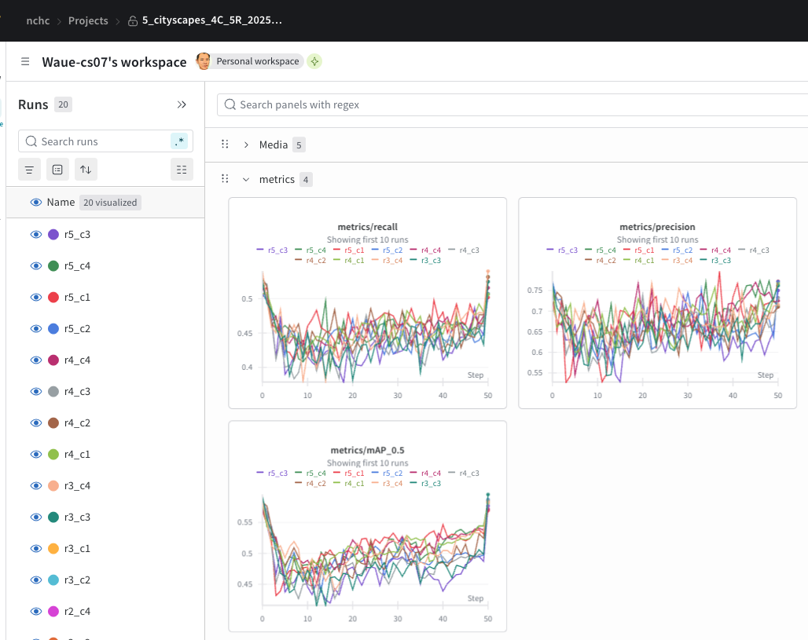

# YOLOv9 聯邦式學習框架

一個基於 YOLOv9 的聯邦式學習系統，使用 Slurm 叢集環境進行分散式訓練和聚合。

## 📋 快速導覽

### 一、說明
- [系統概述](#-系統概述)
- [環境需求](#-環境需求)
- [安裝與設定](#-安裝與設定)
- [目錄結構](#-目錄結構)

### 二、執行
- [快速開始 (自動模式)](#-快速開始-自動模式)
- [手動執行標準作業程序 (SOP)](#-手動執行標準作業程序-sop)

### 三、驗證與補充
- [模型驗證說明](#-模型驗證說明)
- [監控與偵錯指南](#-監控與偵錯指南)

---

## 🎯 系統概述

本框架旨在實現一個完整的聯邦式學習 (Federated Learning) 流程。初始模型權重 (`yolov9-c.pt`) 會分發給多個客戶端 (Client)，客戶端在各自的資料子集上進行訓練後，將更新後的權重傳回伺服器進行聚合 (Federated Averaging)，產生新一輪的全域模型。此過程會重複多個輪次，以期在保護資料隱私的前提下，訓練出一個高效能的全域模型。

### 聯邦學習流程示意
```
Round 1: yolov9-c.pt → [Client1, Client2, Client3, Client4] → w_s_r1.pt
Round 2: w_s_r1.pt  → [Client1, Client2, Client3, Client4] → w_s_r2.pt
Round 3: w_s_r2.pt  → [Client1, Client2, Client3, Client4] → w_s_r3.pt
...
```

---

## 🛠️ 環境需求

- **作業系統**: Linux
- **作業調度器**: Slurm Workload Manager
- **容器引擎**: Singularity
- **Python**: ≥ 3.8
- **GPU**: NVIDIA GPU (支援 CUDA)
- **主要依賴**: PyTorch (≥ 2.1.0), Wandb (實驗追蹤)

---

## 📦 安裝與設定

### 1. 取得專案與子模組
```bash
# Clone 主專案
git clone <repository-url>
cd fl_yolo_slurm

# 初始化並下載 yolov9 子模組
git submodule update --init --recursive
```

### 2. 準備必要檔案
確保以下檔案已放置於專案根目錄：
- **Singularity 映像檔**: `yolo9t2_ngc2306_20241226.sif`
- **初始權重**: `yolov9-c.pt`

### 3. 準備資料集
將您的資料集放置在 `datasets/` 目錄下，並在 `data/` 中建立對應的 `.yaml` 設定檔。詳細說明請參考 `datasets/README.md`。

### 4. 目錄結構
```
.
├── README.md               # 舊版說明文件
├── README_v2.md            # 本文件 (新版主入口)
├── readme_sop.md           # 📖 手動執行 SOP 指南
├── readme_val.md           # 📊 模型驗證指南
├── readme_debug.md         # 🔍 偵錯指南
├── yolov9/                 # YOLOv9 原始碼 (Git Submodule)
├── src/                    # 主要腳本目錄
│   ├── orchestrate.sh      # 主協調腳本
│   ├── data_prepare.py     # 資料分割腳本
│   └── ...
├── data/                   # 資料集 YAML 設定檔
├── datasets/               # 放置原始資料集
├── federated_data/         # 存放分割後的客戶端資料
├── experiments/            # 所有實驗結果的輸出根目錄
│   └── {EXP_ID}/
├── yolo9t2_ngc2306_20241226.sif    # Singularity 容器
└── yolov9-c.pt             # 初始預訓練權重
```


---

## 🚀 快速開始 (自動模式)

這是最推薦的執行方式。此命令將自動完成資料準備、模型訓練、權重聚合等所有步驟。

### 基本語法
```bash
Usage: ./src/orchestrate.sh <DATASET_NAME> <CLIENT_NUM> <TOTAL_ROUNDS> [--manual] [--val]
```
### 全自動模式 範例
```bash
# 使用 kitti 資料集，4 個客戶端，進行 2 輪聯邦學習
./src/orchestrate.sh kitti 4 2
```
> **提示**: 若要包含最終的模型驗證，請加上 `--val` 旗標。
* 執行畫面，會自動偵測是否要分割資料集，然後發起n+1個slurm程序
    * n client train (parallel)
    * 1 server aggregate  (waiting for client complete)

---

### 📖 手動模式的進階說明 (SOP)
* 手動模式
    - 以下指令會產生出 sop.sh ，可以照著這份腳本一行一行操作
```bash
# 使用 kitti 資料集，4 個客戶端，進行 2 輪聯邦學習
./src/orchestrate.sh kitti 4 2 --manual --val > sop.sh
```

* 此方法目的在於方便偵錯與詳細觀察。詳細步驟請參考：
- **[📖 手動執行標準作業程序 (SOP) 指南](./readme_sop.md)**


---

## 📊 模型驗證說明

本系統提供對聯邦學習模型效能的完整分析。詳細的啟用與操作方式請參考：
- **[📊 模型驗證說明文件](./readme_val.md)**


---

## 🔍 監控與偵錯指南

提供 Slurm 監控、日誌檢查和常見問題的解決方案。詳細內容請參考：
- **[🔍 監控與偵錯指南](./readme_debug.md)**


---
**最後更新**：2025-08-12  
**版本**：v2.1 (導覽版)  
**維護者**：nchc/waue0920

---

## 📸 執行結果快照 (Execution Result Snapshot)

以下是聯邦學習過程中的一些視覺化結果，包含模型驗證成效與訓練指標。

### 1. 模型驗證成果 (Validation Result)
這是使用 Cityscapes 資料集進行 4 個客戶端、5 輪聯邦學習後，對驗證圖片進行物件偵測的結果。


### 2. 訓練指標 (依聯邦輪次)
下圖顯示了在 5 個聯邦輪次中，各項指標 (如 mAP50, mAP50-95) 的變化趨勢。


### 3. 訓練指標 (依訓練週期)
下圖將所有客戶端的訓練週期 (Epoch) 連續繪製，展示了模型在整個訓練過程中的學習曲線。


### 4. Wandb 儀表板
Wandb 提供了詳細的實驗追蹤，下圖是本次實驗在 Wandb 儀表板上的部分截圖。

