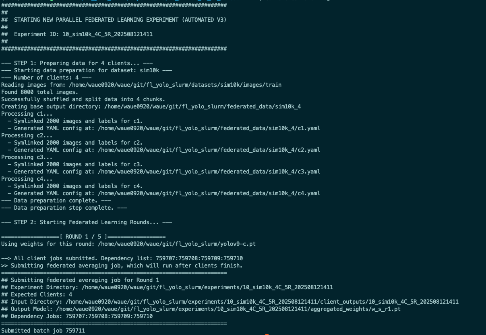
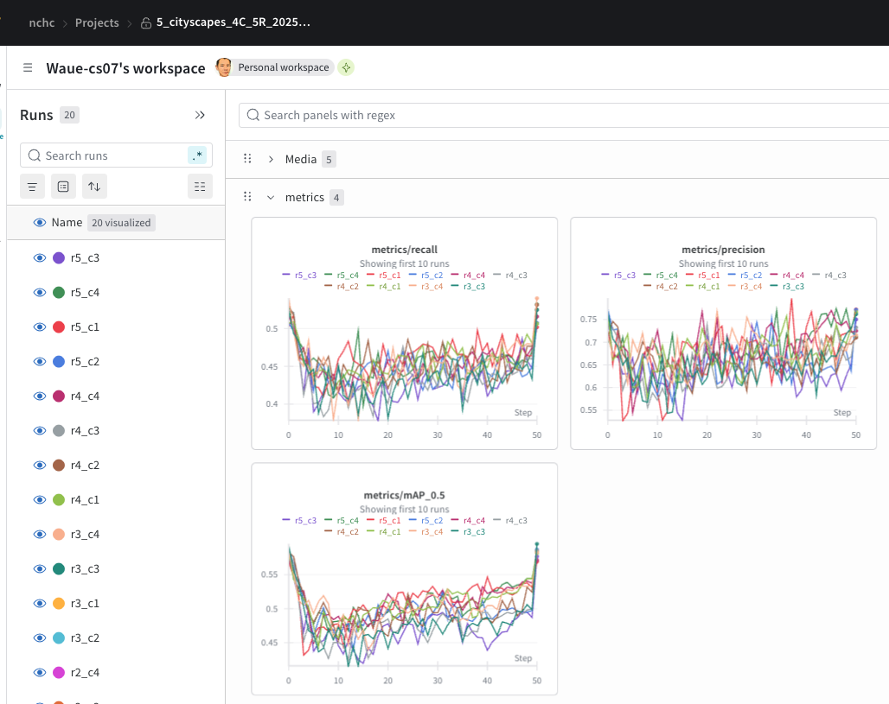

[**English Version (英文版)**](README.md)

# Paper : FedYOGA implementation 
## 目錄

- [一、說明](#1-說明)
- [1.1 目錄結構](#11-目錄結構)
- [1.2 資料集準備](#12-準備資料集)
- [二、執行](#2-快速開始)
- [2A.1 系統概述](#2a1-系統概述)
- [2A.2 環境需求](#2a2-環境需求)
- [2A.3 執行方式](#2a3-執行方式)
- [2A.4 實驗續跑 (Replay)](#2a4-實驗續跑-replay)
- [2B.1 環境設定](#2b1-環境設定)
- [2B.2 執行 Standalone 模式](#2b2-執行-standalone-模式)
- [2B.3 單元測試](#2b3-單元測試)
- [三、驗證與補充](#3-驗證與補充)
- [3.1 模型驗證說明](#31-模型驗證說明)
- [3.2 監控與偵錯指南](#32-監控與偵錯指南)
- [3.3 支援的聚合演算法](#33-支援的聚合演算法)
- [四、執行結果快照](#4-執行結果快照-execution-result-snapshot)
- [4.1 模型驗證成果](#41-模型驗證成果-validation-result)
- [4.2 訓練指標 (依聯邦輪次)](#42-訓練指標-依聯邦輪次)
- [4.3 訓練指標 (依訓練週期)](#43-訓練指標-依訓練週期)
- [4.4 Wandb 儀表板](#44-wandb-儀表板)

---

## 一、說明

### 1.1 目錄結構
```
.
├── README.md               # 說明文件
├── readme_sop.md           # 手動執行 SOP 指南
├── readme_val.md           # 模型驗證指南
├── readme_debug.md         # 偵錯指南
├── yolov9/                 # YOLOv9 原始碼 (Git Submodule)
├── src/                    # 主要目錄
│   ├── orchestrate.sh      # 主程式
│   └── ...                 # 其他輔助腳本
├── data/                   # 資料集 YAML 設定檔
├── datasets/               # 放置原始資料集
├── federated_data/         # 存放分割後的客戶端資料
├── experiments/            # 所有實驗結果的輸出根目錄
│   └── {EXP_ID}/
├── yolo9t2_ngc2306_20241226.sif    # Singularity 容器
└── yolov9-c.pt             # 初始預訓練權重
```

確保以下檔案已放置於專案根目錄：
- **Singularity 映像檔**: `yolo9t2_ngc2306_20241226.sif` ([twcc-cos載點](https://cos.twcc.ai/wauehpcproject/yolo9t2_ngc2306_20241226.sif))
- **初始權重**: `yolov9-c.pt` ([official載點](https://github.com/WongKinYiu/yolov9/releases/download/v0.1/yolov9-c.pt))


### 1.2 準備資料集
將您的資料集放置在 `datasets/` 目錄下，並在 `data/` 中建立對應的 `.yaml` 設定檔。
- **[資料集準備指南](./readme_datasets.md)**


## 二、快速開始

兩種執行方式
- (2A) slurm 模式，預設使用國網中心TWCC HPC環境，plug-and-play模式，執行環境為 Singularity 容器。
- (2B) standalone 模式，執行環境 建議使用conda environment，套件庫與 yolov9 相同。


### 2A  全自動模式 (Slurm 叢集)

#### 2A.1 系統概述

本框架旨在使用國網中心的 HPC 叢集環境 (TWCC / N5)，實現一個完整的聯邦式學習 (Federated Learning) 流程。

本專案預設使用初始模型權重 (`yolov9-c.pt`) 做pretrai，分發給多個客戶端 (Client)，客戶端在各自的資料子集上進行訓練後，將更新後的權重傳回伺服器進行聚合 (Federated Averaging)，產生新一輪的全域模型。此過程會重複多個輪次，以期在保護資料隱私的前提下，訓練出一個高效能的全域模型。

* 聯邦學習流程示意
```
Round 1: yolov9-c.pt → [Client1, Client2, Client3, Client4] → w_s_r1.pt
Round 2: w_s_r1.pt  → [Client1, Client2, Client3, Client4] → w_s_r2.pt
Round 3: w_s_r2.pt  → [Client1, Client2, Client3, Client4] → w_s_r3.pt
...
```


#### 2A.2 環境需求
- **執行環境** : NCHC [TWCC](https://www.nchc.org.tw/Page?itemid=6&mid=10)
  - **作業系統**: Linux
  - **作業調度器**: Slurm Workload Manager
  - **容器引擎**: Singularity
  - **Python**: ≥ 3.8
  - GPU: NVIDIA GPU (支援 CUDA)
  - **Pytorch**: PyTorch (≥ 2.1.0)
  - 實驗追蹤 : Wandb 

#### 2A.3 執行方式

! 需修改 src/env.sh 中 WROOT 環境變數

export WROOT="/home/waue0920/fl_yolo_slurm"
export SLURM_ACCOUNT="GOV113119" 

```bash
# 方式 1: 使用 sbatch (所有工作都在工作節點執行)
sbatch src/run.sb 

# 方式 2: 使用 orchestrate.sh (少數工作在登入節點執行)
./src/orchestrate.sh kitti 4 2
```
> **提示**: 若要包含最終的模型驗證，請加上 `--val` 旗標。

執行畫面會自動偵測是否要分割資料集，然後發起 n+1 個 Slurm 程序：
- n 個 client train (parallel)
- 1 個 server aggregate (waiting for client complete)




#### 2A.4 實驗續跑 (Replay)

如果聯邦學習實驗中途失敗，可以使用 `replay.sh` 從中斷點繼續執行：

```bash
./src/replay.sh experiments/18_kitti_fedavg_4C_6R_202510010849
```

- ✅ 自動檢測已完成的輪數
- ✅ 從失敗點繼續執行
- ✅ 完整的日誌記錄
- ✅ 避免重複執行已完成的輪次


### 2B Standalone 模式 (無 Slurm)

適合在本地環境或沒有 Slurm 的伺服器上進行測試。

- ✅ 不需要 Slurm 環境
- ✅ 順序執行所有客戶端訓練
- ✅ 適合小規模測試和除錯
- ✅ 支援 dry-run 預覽模式

#### 2B.1 環境設定
```bash
# 使用 YOLOv9 的 requirements 安裝 Python 依賴
pip install -r yolov9/requirements.txt
```

#### 2B.2 執行 Standalone 模式
* 以kitti資料集為例
* 需修改 conf/kittiO/4/fedavg_env.sh 中 WROOT 環境變數
* 其他 slurm 的設定可以忽略不會用到

export WROOT="/home/waue0920/fl_yolo_slurm"

```bash
# 所有參數從 env.sh 讀取
./src/standalone_orchestrate.sh --conf conf/kittiO/4/fedavg_env.sh

# Dry-run 模式：只顯示命令，不實際執行
./src/standalone_orchestrate.sh --dry-run
```


#### 2B.3 單元測試

快速測試聚合演算法和訓練流程：
**測試流程**：
1. 使用既有實驗的 Round 1 客戶端輸出進行聚合測試
2. 使用聚合後的權重進行 Round 2 客戶端訓練測試
3. 驗證 loss 值是否正常、NaN/Inf 處理是否正確

```bash
# 編輯 src/run_unit_test.sh 設定 EXP_ID 和演算法
# 然後執行
./src/run_unit_test.sh
```


## 三、驗證與補充

### 3.1 模型驗證說明

本系統提供對聯邦學習模型效能的完整分析。詳細的啟用與操作方式請參考：
- **[3.1 模型驗證說明文件](./readme_val.md)**


### 3.2 監控與偵錯指南

提供 Slurm 監控、日誌檢查和常見問題的解決方案。詳細內容請參考：
- **[ 監控與偵錯指南](./readme_debug.md)**


### 3.3 支援的聚合演算法

本框架支援多種先進的聯邦學習聚合演算法，可在 `src/env.sh` 中設定 `SERVER_ALG` 變數：

| 演算法 | 說明 | 適用場景 | 超參數 |
|--------|------|---------|--------|
| **fedavg** | 標準聯邦平均 | 通用，IID 數據 | - |
| **fedavgm** | FedAvgM (Server 端動量) | 加速收斂 | `SERVER_FEDAVGM_LR`, `SERVER_FEDAVGM_MOMENTUM` |
| **fedawa** | FedAWA (自適應權重聚合) | Non-IID 數據 | `SERVER_FEDAWA_SERVER_LR`, `SERVER_FEDAWA_GAMMA` |
| **fedyoga** | **FedYOGA (自適應權重)** | **Non-IID 數據，不均衡** | `SERVER_FEDYOGA_SERVER_LR`, `SERVER_FEDYOGA_GAMMA` |
| **fednova** | FedNova (標準化聚合) | 異質訓練步數 | `SERVER_FEDNOVA_MU`, `SERVER_FEDNOVA_LR` |


## 四、執行結果快照 (Execution Result Snapshot)

以下是聯邦學習過程中的一些視覺化結果，包含模型驗證成效與訓練指標。

### 4.1 模型驗證成果 (Validation Result)
這是使用 Cityscapes 資料集進行 4 個客戶端、5 輪聯邦學習後，對驗證圖片進行物件偵測的結果。


### 4.2 訓練指標 (依聯邦輪次)
下圖顯示了在 5 個聯邦輪次中，各項指標 (如 mAP50, mAP50-95) 的變化趨勢。


### 4.3 訓練指標 (依訓練週期)
下圖將所有客戶端的訓練週期 (Epoch) 連續繪製，展示了模型在整個訓練過程中的學習曲線。


### 4.4 Wandb 儀表板
Wandb 提供了詳細的實驗追蹤，下圖是本次實驗在 Wandb 儀表板上的部分截圖。

